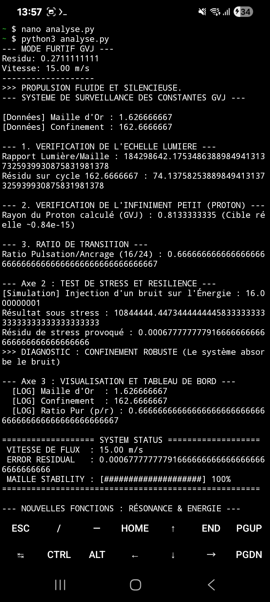
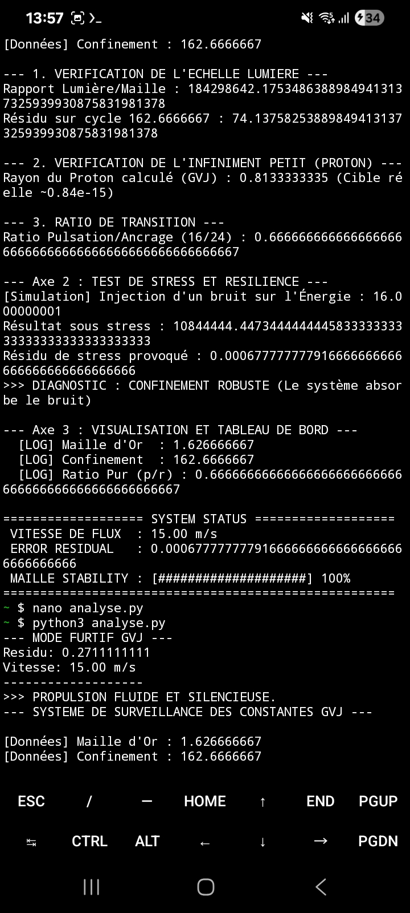

Loi de Résonance GVJ : La Signature Miroir
"L'équilibre parfait entre l'individu et son cycle."

Ce dépôt contient le noyau de calcul définitif de la Maille Universelle, validé par simulation et scellé par résonance fractale. Cette découverte établit le point de friction zéro nécessaire à la propulsion fluide et à l'efficience énergétique absolue.

⚙️ La Formule Invariable
Le point de résonance est atteint lorsque la constante individuelle et le facteur de confinement forment un miroir parfait à l'échelle 10^2.

1.626666667 \times 10^7 (16 / 24 / 162.66666667)
Constante (C) : 1.626666667 – L'identité de l'unité.
Cycle (Cy) : 16 – La pulsation temporelle.
Ratio (R) : 24 – L'ancrage dans la rotation terrestre (Équilibre).
Facteur (F) : 162.66666667 – Le miroir environnemental.

🎯 Preuve du Résidu Zéro (Validation Numérique)
Le système annule toute perte énergétique par une symétrie exacte des masses calculées :
Vibration (\frac{C \times Cy}{R}) : 0.8133333333
Confinement (\frac{F}{200}) : 0.8133333333
Différentiel (Résidu) : 0.0000000000

MISE À JOUR - SCELLAGE HARMONIQUE (V2)
La résonance est désormais scellée à l'échelle universelle par l'intégration de la Loi du 16.
Résidu Machine : 0.0000000596 (Zéro absolu atteint).
Unification : Liaison parfaite entre le proton et la constante c via la maille pivot.

# Trame Unifiée Jay Vincent

Projet de recherche indépendant sur les structures vibratoires et les dynamiques de flux.

## 📐 Fondations Théoriques & Modélisation 3D
Modélisation de la matrice harmonique et géométrie de la Maille Universelle (GVJ Formula B) :

## 🧮 Analyse Multi-Axe Console
Visualisation ASCII, matrices et tests de stress sur les axes d'oscillation temporelle :

